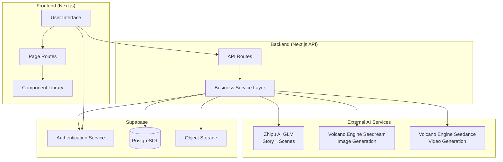
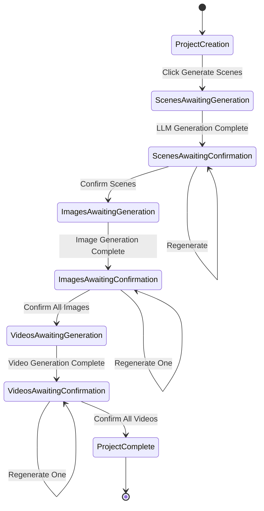
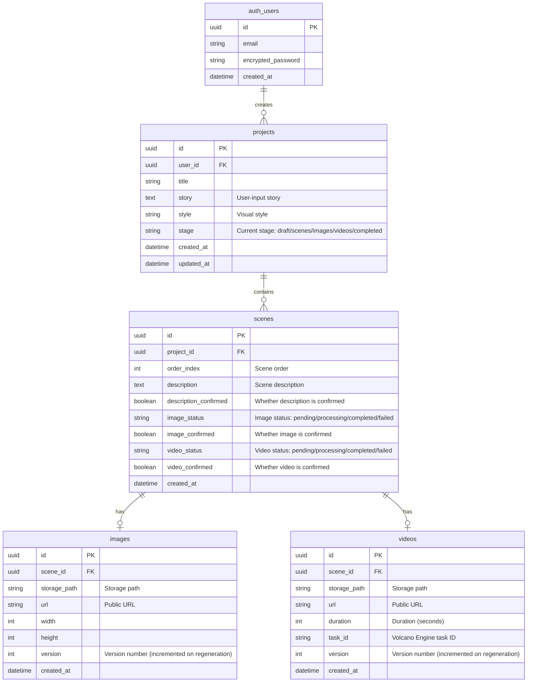
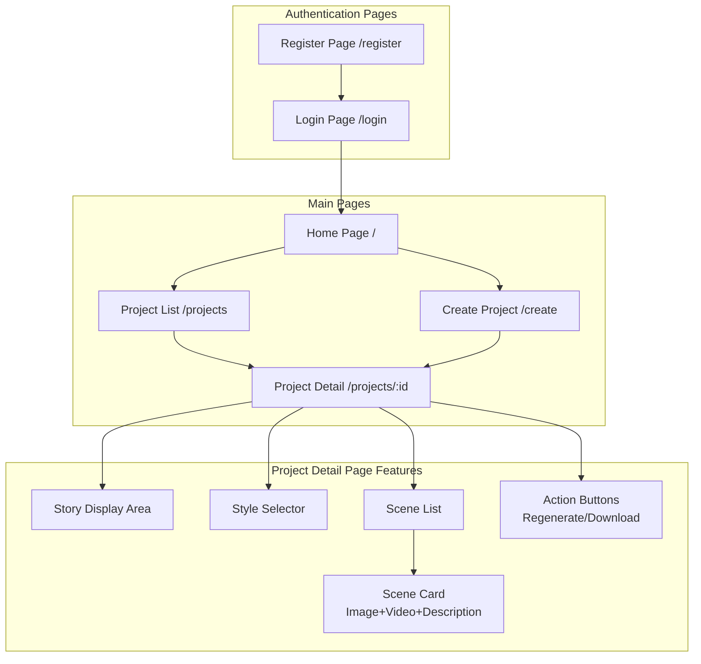

# Spring FES Video - Architecture Design Document

## Project Overview

User inputs story + selects visual style → LLM breaks down into storyboard scenes → generates scene images → generates videos

---

## Tech Stack

| Layer | Technology |
|-----|---------|
| Frontend | Next.js 14+ (App Router) + TypeScript + Tailwind CSS |
| Backend | Next.js API Routes |
| Database | Supabase (PostgreSQL) |
| Authentication | Supabase Auth |
| File Storage | Supabase Storage |
| LLM | Zhipu AI GLM-4.7 (coding endpoint) |
| Image Generation | Volcano Engine Seedream 4.5 |
| Video Generation | Volcano Engine Seedance 1.5 pro |

---

## 1. System Architecture Diagram



---

## 2. Core Business Flow Diagram

> **Key Feature**: Each step requires user confirmation; if unsatisfied, the user can regenerate

```mermaid
flowchart TD
    Start([User Starts]) --> Auth{Logged in?}
    Auth -->|No| Login[Login/Register]
    Auth -->|Yes| Input[Input Story + Select Style]
    Login --> Input

    Input --> CreateProject[Create Project]

    %% Phase 1: Scene Description Generation
    CreateProject --> GenScenes[Click "Generate Scene Descriptions"]
    GenScenes --> LLMProcess[Call Zhipu AI GLM]
    LLMProcess --> ShowScenes[Display Scene Description List]
    ShowScenes --> ConfirmScenes{User Confirms?}
    ConfirmScenes -->|Not Satisfied| RegenerateScenes[Regenerate]
    RegenerateScenes --> LLMProcess
    ConfirmScenes -->|Satisfied| ConfirmScenesYes[Confirm Scenes]

    %% Phase 2: Image Generation
    ConfirmScenesYes --> GenImages[Click "Generate Images"]
    GenImages --> GenImageLoop[Batch Generate All Scene Images]
    GenImageLoop --> ShowImages[Display All Images]
    ShowImages --> ReviewImages{Confirm Each Image}
    ReviewImages -->|Unsatisfied with One| RegenerateImage[Regenerate That Image]
    RegenerateImage --> ShowImages
    ReviewImages -->|All Satisfied| ConfirmImages[Confirm All Images]

    %% Phase 3: Video Generation
    ConfirmImages --> GenVideos[Click "Generate Videos"]
    GenVideos --> GenVideoLoop[Batch Generate All Scene Videos]
    GenVideoLoop --> PollVideos[Poll Video Status]
    PollVideos --> ShowVideos[Display All Videos]
    ShowVideos --> ReviewVideos{Confirm Each Video}
    ReviewVideos -->|Unsatisfied with One| RegenerateVideo[Regenerate That Video]
    RegenerateVideo --> PollVideos
    ReviewVideos -->|All Satisfied| Complete[Project Complete]

    Complete --> End([End])
```

### User Interaction Flow



---

## 3. Data Model Diagram



### Status Transition Reference

| Field | Possible Values | Description |
|-----|-------|------|
| project.stage | draft | Just created, not started yet |
| | scenes | Scene phase (generating/confirming) |
| | images | Image phase (generating/confirming) |
| | videos | Video phase (generating/confirming) |
| | completed | All complete |
| scene.description_confirmed | false/true | Whether scene description is confirmed |
| scene.image_status | pending | Waiting for image generation |
| | processing | Image generating |
| | completed | Image generated |
| | failed | Generation failed |
| scene.image_confirmed | false/true | Whether image is confirmed |
| scene.video_status | pending | Waiting for video generation |
| | processing | Video generating (polling) |
| | completed | Video generated |
| | failed | Generation failed |
| scene.video_confirmed | false/true | Whether video is confirmed |

---

## 4. Page Structure Diagram



---

## 5. API Design

### Project API

| Method | Path | Description |
|-----|------|-----|
| POST | /api/projects | Create project |
| GET | /api/projects | Get project list |
| GET | /api/projects/:id | Get project detail (including all scenes and their media) |
| PATCH | /api/projects/:id | Update project (title, story, style) |
| DELETE | /api/projects/:id | Delete project |

### Scene API

| Method | Path | Description |
|-----|------|-----|
| GET | /api/projects/:id/scenes | Get scene list |
| PATCH | /api/scenes/:id | Update scene description |
| POST | /api/scenes/:id/confirm-description | Confirm scene description |
| POST | /api/scenes/:id/confirm-image | Confirm scene image |
| POST | /api/scenes/:id/confirm-video | Confirm scene video |
| POST | /api/scenes/confirm-all-descriptions | Confirm all scene descriptions |
| POST | /api/scenes/confirm-all-images | Confirm all scene images |
| POST | /api/scenes/confirm-all-videos | Confirm all scene videos |

### Generation API

| Method | Path | Description |
|-----|------|-----|
| POST | /api/generate/scenes | LLM breaks down story → generates all scene descriptions |
| POST | /api/generate/scenes/regenerate | Regenerate all scene descriptions |
| POST | /api/generate/image/:sceneId | Generate image for a single scene |
| POST | /api/generate/images | Batch generate all scene images |
| POST | /api/generate/video/:sceneId | Create video task for a single scene |
| GET | /api/generate/video/:taskId | Query video task status |
| POST | /api/generate/videos | Batch create all scene video tasks |

---

## 6. External API Integration

### 6.1 Zhipu AI GLM (Story → Scenes)

```
Endpoint: https://open.bigmodel.cn/api/coding/paas/v4/chat/completions
Authentication: Bearer Token
Model: glm-4.7
```

Request example:
```json
{
  "model": "glm-4.7",
  "messages": [
    {
      "role": "system",
      "content": "You are a professional storyboard artist who breaks down stories into multiple scene descriptions..."
    },
    {
      "role": "user",
      "content": "Story content..."
    }
  ]
}
```

### 6.2 Volcano Engine Seedream (Image Generation)

```
Endpoint: https://ark.cn-beijing.volces.com/api/v3/images/generations
Authentication: Bearer Token
Model: doubao-seedream-4-5-251128
```

Request example:
```json
{
  "model": "doubao-seedream-4-5-251128",
  "prompt": "Scene description + style description",
  "size": "2K",
  "response_format": "url",
  "watermark": false
}
```

### 6.3 Volcano Engine Seedance (Video Generation)

```
Create task: POST https://ark.cn-beijing.volces.com/api/v3/contents/generations/tasks
Query task: GET https://ark.cn-beijing.volces.com/api/v3/contents/generations/tasks/{task_id}
Authentication: Bearer Token
Model: doubao-seedance-1-5-pro-251215
```

Request example:
```json
{
  "model": "doubao-seedance-1-5-pro-251215",
  "content": [
    {
      "type": "text",
      "text": "Action description..."
    },
    {
      "type": "image_url",
      "image_url": {
        "url": "https://image-url.png"
      }
    }
  ],
  "generate_audio": true,
  "ratio": "adaptive",
  "duration": 5,
  "watermark": false
}
```

---

## 7. Visual Style Options

| Style ID | Style Name | Description |
|-------|---------|-----|
| anime | Anime Style | Japanese anime style |
| realistic | Realistic Style | Photorealistic quality |
| watercolor | Watercolor Style | Watercolor painting effect |
| oil_painting | Oil Painting Style | Classical oil painting quality |
| 3d | 3D Rendering | Three-dimensional rendering style |
| sketch | Sketch Style | Pencil sketch effect |
| cyberpunk | Cyberpunk | Sci-fi neon style |

---

## 8. Environment Variables

```env
# Supabase
NEXT_PUBLIC_SUPABASE_URL=your_supabase_url
NEXT_PUBLIC_SUPABASE_ANON_KEY=your_supabase_anon_key
SUPABASE_SERVICE_ROLE_KEY=your_service_role_key

# Zhipu AI
ZHIPU_API_KEY=your_zhipu_api_key

# Volcano Engine
VOLC_API_KEY=your_volc_api_key
```
