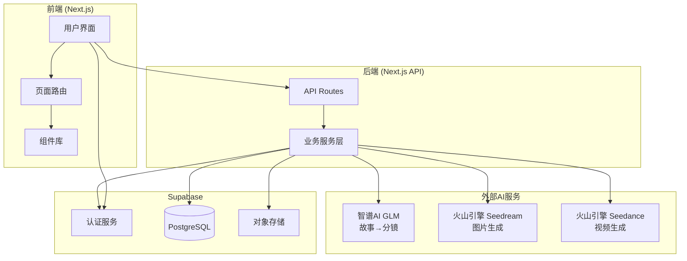
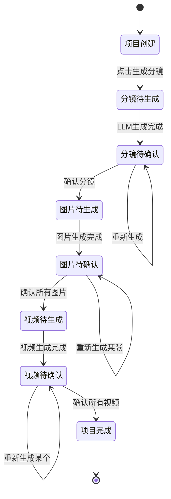
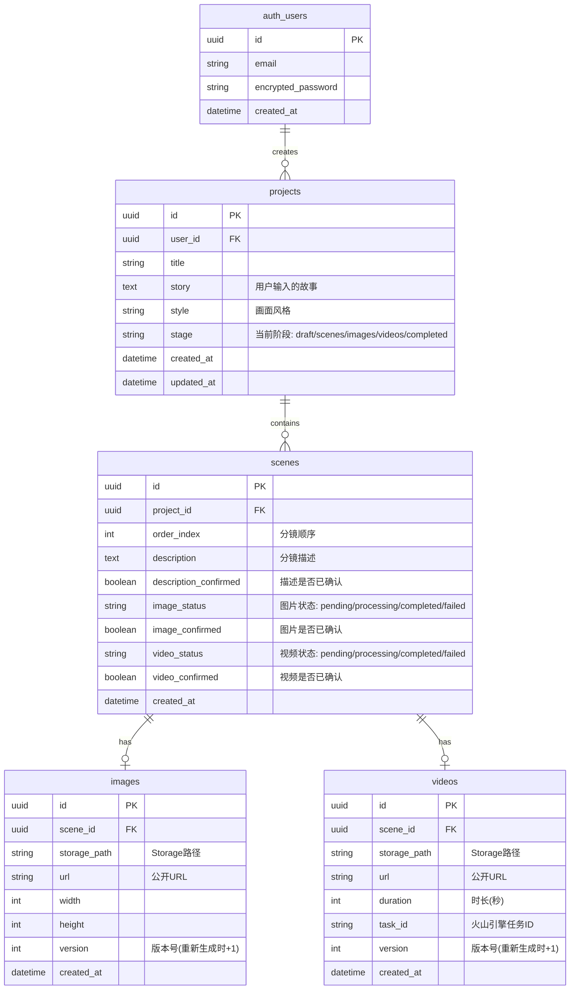
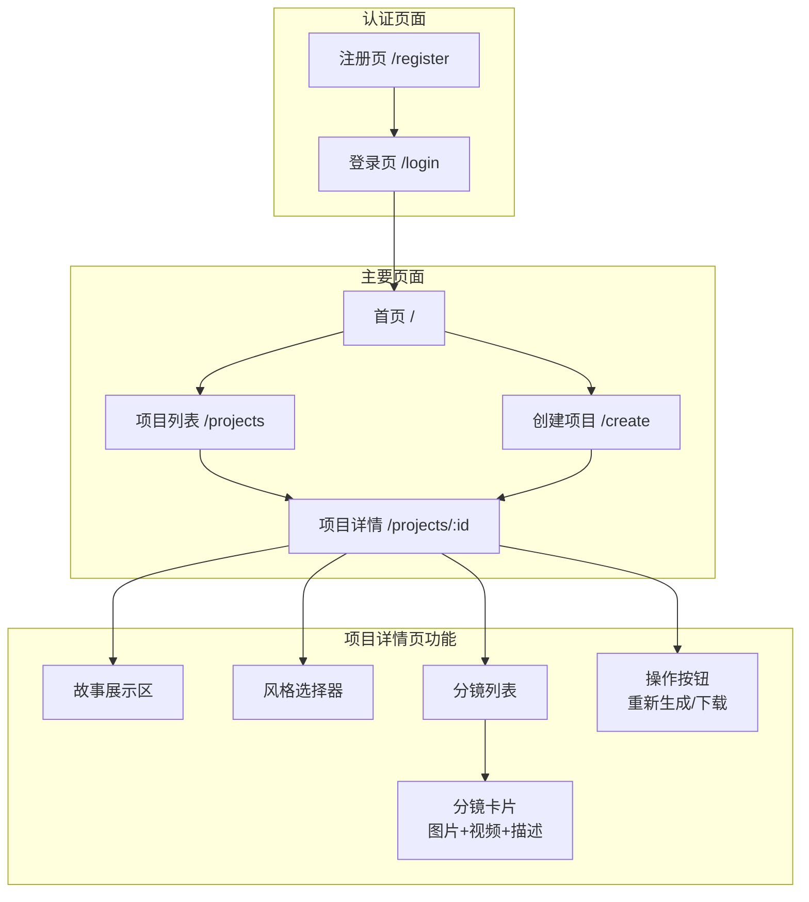

# Spring FES Video - 架构设计文档

## 项目概述

用户输入故事 + 选择画面风格 → LLM拆解分镜 → 生成分镜图片 → 生成视频

---

## 技术栈

| 层级 | 技术选型 |
|-----|---------|
| 前端 | Next.js 14+ (App Router) + TypeScript + Tailwind CSS |
| 后端 | Next.js API Routes |
| 数据库 | Supabase (PostgreSQL) |
| 认证 | Supabase Auth |
| 文件存储 | Supabase Storage |
| LLM | 智谱AI GLM-4.7 (coding端点) |
| 图片生成 | 火山引擎 Seedream 4.5 |
| 视频生成 | 火山引擎 Seedance 1.5 pro |

---

## 1. 系统架构图



---

## 2. 核心业务流程图

> **关键特性**: 每一步都需要用户确认，不满意可重新生成

```mermaid
flowchart TD
    Start([用户开始]) --> Auth{已登录?}
    Auth -->|否| Login[登录/注册]
    Auth -->|是| Input[输入故事 + 选择风格]
    Login --> Input

    Input --> CreateProject[创建项目]

    %% 阶段1: 分镜描述生成
    CreateProject --> GenScenes[点击"生成分镜描述"]
    GenScenes --> LLMProcess[调用智谱AI GLM]
    LLMProcess --> ShowScenes[显示分镜描述列表]
    ShowScenes --> ConfirmScenes{用户确认?}
    ConfirmScenes -->|不满意| RegenerateScenes[重新生成]
    RegenerateScenes --> LLMProcess
    ConfirmScenes -->|满意| ConfirmScenesYes[确认分镜]

    %% 阶段2: 图片生成
    ConfirmScenesYes --> GenImages[点击"生成图片"]
    GenImages --> GenImageLoop[批量生成所有分镜图片]
    GenImageLoop --> ShowImages[显示所有图片]
    ShowImages --> ReviewImages{逐个确认图片}
    ReviewImages -->|某张不满意| RegenerateImage[重新生成该图片]
    RegenerateImage --> ShowImages
    ReviewImages -->|全部满意| ConfirmImages[确认所有图片]

    %% 阶段3: 视频生成
    ConfirmImages --> GenVideos[点击"生成视频"]
    GenVideos --> GenVideoLoop[批量生成所有分镜视频]
    GenVideoLoop --> PollVideos[轮询视频状态]
    PollVideos --> ShowVideos[显示所有视频]
    ShowVideos --> ReviewVideos{逐个确认视频}
    ReviewVideos -->|某个不满意| RegenerateVideo[重新生成该视频]
    RegenerateVideo --> PollVideos
    ReviewVideos -->|全部满意| Complete[项目完成]

    Complete --> End([结束])
```

### 用户交互流程



---

## 3. 数据模型图



### 状态流转说明

| 字段 | 可能值 | 说明 |
|-----|-------|------|
| project.stage | draft | 刚创建，还没开始 |
| | scenes | 分镜阶段（生成/确认中） |
| | images | 图片阶段（生成/确认中） |
| | videos | 视频阶段（生成/确认中） |
| | completed | 全部完成 |
| scene.description_confirmed | false/true | 分镜描述是否已确认 |
| scene.image_status | pending | 等待生成图片 |
| | processing | 图片生成中 |
| | completed | 图片已生成 |
| | failed | 生成失败 |
| scene.image_confirmed | false/true | 图片是否已确认 |
| scene.video_status | pending | 等待生成视频 |
| | processing | 视频生成中（轮询中） |
| | completed | 视频已生成 |
| | failed | 生成失败 |
| scene.video_confirmed | false/true | 视频是否已确认 |

---

## 4. 页面结构图



---

## 5. API 设计

### 项目 API

| 方法 | 路径 | 描述 |
|-----|------|-----|
| POST | /api/projects | 创建项目 |
| GET | /api/projects | 获取项目列表 |
| GET | /api/projects/:id | 获取项目详情（包含所有分镜及其媒体） |
| PATCH | /api/projects/:id | 更新项目（标题、故事、风格） |
| DELETE | /api/projects/:id | 删除项目 |

### 分镜 API

| 方法 | 路径 | 描述 |
|-----|------|-----|
| GET | /api/projects/:id/scenes | 获取分镜列表 |
| PATCH | /api/scenes/:id | 修改分镜描述 |
| POST | /api/scenes/:id/confirm-description | 确认分镜描述 |
| POST | /api/scenes/:id/confirm-image | 确认分镜图片 |
| POST | /api/scenes/:id/confirm-video | 确认分镜视频 |
| POST | /api/scenes/confirm-all-descriptions | 确认所有分镜描述 |
| POST | /api/scenes/confirm-all-images | 确认所有分镜图片 |
| POST | /api/scenes/confirm-all-videos | 确认所有分镜视频 |

### 生成 API

| 方法 | 路径 | 描述 |
|-----|------|-----|
| POST | /api/generate/scenes | LLM拆解故事→生成所有分镜描述 |
| POST | /api/generate/scenes/regenerate | 重新生成所有分镜描述 |
| POST | /api/generate/image/:sceneId | 为单个分镜生成图片 |
| POST | /api/generate/images | 批量生成所有分镜图片 |
| POST | /api/generate/video/:sceneId | 为单个分镜创建视频任务 |
| GET | /api/generate/video/:taskId | 查询视频任务状态 |
| POST | /api/generate/videos | 批量创建所有分镜视频任务 |

---

## 6. 外部 API 集成

### 6.1 智谱AI GLM (故事→分镜)

```
端点: https://open.bigmodel.cn/api/coding/paas/v4/chat/completions
认证: Bearer Token
模型: glm-4.7
```

请求示例:
```json
{
  "model": "glm-4.7",
  "messages": [
    {
      "role": "system",
      "content": "你是一个专业的分镜师，将故事拆解成多个分镜描述..."
    },
    {
      "role": "user",
      "content": "故事内容..."
    }
  ]
}
```

### 6.2 火山引擎 Seedream (图片生成)

```
端点: https://ark.cn-beijing.volces.com/api/v3/images/generations
认证: Bearer Token
模型: doubao-seedream-4-5-251128
```

请求示例:
```json
{
  "model": "doubao-seedream-4-5-251128",
  "prompt": "分镜描述 + 风格描述",
  "size": "2K",
  "response_format": "url",
  "watermark": false
}
```

### 6.3 火山引擎 Seedance (视频生成)

```
创建任务: POST https://ark.cn-beijing.volces.com/api/v3/contents/generations/tasks
查询任务: GET https://ark.cn-beijing.volces.com/api/v3/contents/generations/tasks/{task_id}
认证: Bearer Token
模型: doubao-seedance-1-5-pro-251215
```

请求示例:
```json
{
  "model": "doubao-seedance-1-5-pro-251215",
  "content": [
    {
      "type": "text",
      "text": "动作描述..."
    },
    {
      "type": "image_url",
      "image_url": {
        "url": "https://image-url.png"
      }
    }
  ],
  "generate_audio": true,
  "ratio": "adaptive",
  "duration": 5,
  "watermark": false
}
```

---

## 7. 画面风格选项

| 风格ID | 风格名称 | 描述 |
|-------|---------|-----|
| anime | 动漫风格 | 日本动漫风格 |
| realistic | 写实风格 | 真实照片质感 |
| watercolor | 水彩风格 | 水彩画效果 |
| oil_painting | 油画风格 | 古典油画质感 |
| 3d | 3D渲染 | 三维渲染风格 |
| sketch | 素描风格 | 铅笔素描效果 |
| cyberpunk | 赛博朋克 | 科幻霓虹风格 |

---

## 8. 环境变量

```env
# Supabase
NEXT_PUBLIC_SUPABASE_URL=your_supabase_url
NEXT_PUBLIC_SUPABASE_ANON_KEY=your_supabase_anon_key
SUPABASE_SERVICE_ROLE_KEY=your_service_role_key

# 智谱AI
ZHIPU_API_KEY=your_zhipu_api_key

# 火山引擎
VOLC_API_KEY=your_volc_api_key
```
